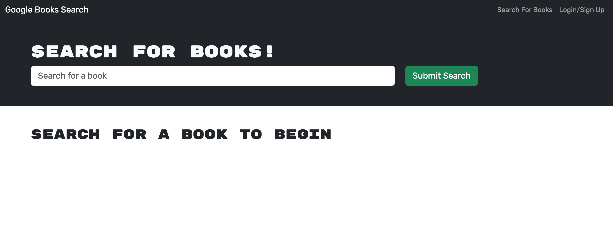
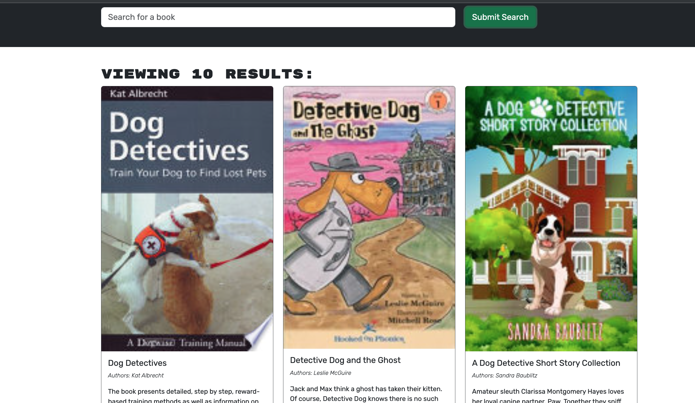
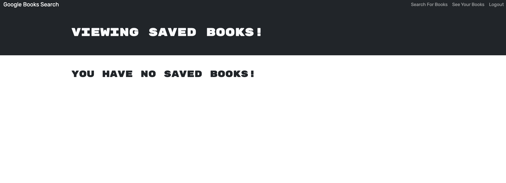
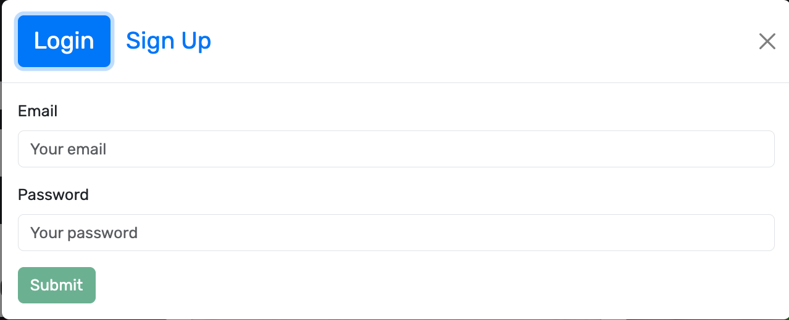

# Book Search Engine

## Overview

This project is a Book Search Engine that allows users to search for books, create an account, log in, save books to their account, view their saved books, and remove books from their saved list. It provides a seamless experience for book enthusiasts to explore, save, and manage their favorite reads.

## Features

- **Search for Books:** Users can search for books using keywords.
- **User Authentication:** Users can create an account or log in to access additional features.
- **Save Books:** Logged-in users can save books to their account for future reference.
- **View Saved Books:** Users can view a list of books they have saved to their account.
- **Remove Books:** Users can remove books from their saved list.
- **Logout:** Allows users to securely log out of their account.

## Usage

### Searching for Books

- Upon loading the search engine, users are presented with a menu featuring options to "Search for Books" and "Login/Signup."
- Users can enter a search term in the input field and click the submit button to search for books.
- Search results display book titles, authors, descriptions, images, and links to the corresponding book on the Google Books site.

### User Authentication

- Clicking on the "Login/Signup" menu option opens a modal with options to log in or sign up.
- When signing up, users provide a username, email address, and password.
- Upon successful signup, users are automatically logged in to the site.
- Logging in requires users to enter their email address and password.
- Once logged in, the menu options change to include "Search for Books," "Saved Books," and "Logout."

### Saving and Managing Books

- Logged-in users can save books to their account by clicking the "Save" button on a search result.
- Saved books can be viewed by clicking on the "Saved Books" menu option.
- The saved books list displays titles, authors, descriptions, images, and links to the corresponding book on Google Books.
- Users can remove books from their saved list by clicking the "Remove" button on a saved book.

### Logging Out

- Clicking the "Logout" button securely logs users out of their account.
- Upon logout, users are presented with the initial menu options to search for books and login/signup.

## Technologies Used

- Frontend: HTML, CSS, JavaScript
- Backend: Node.js, Express.js, MongoDB, Mongoose
- Database: MongoDB Atlas
- External APIs: Google Books API

## Installation

- Clone the repository from GitHub.
- Run `npm install` to install the required dependencies.
- Create a `.env` file in the root directory and add the following environment variables:
  - `MONGODB_URI`: MongoDB connection string
    - `JWT_SECRET`: JSON Web Token secret key
- Run `npm start` to start the server.
- Open a web browser and navigate to `http://localhost:3001` to access the Book Search Engine.

## Deployment

The Book Search Engine is deployed on Render. You can access the deployed application [here](https://book-search-engine-jjhw.onrender.com/).

## Screenshots

### Home Page

### Search Results

### Saved Books

### Login/Signup Modal

## Contributions

Contributions are welcome! Please feel free to submit bug reports, feature requests, or pull requests through GitHub.

## License

This project is licensed under the [MIT License](LICENSE).